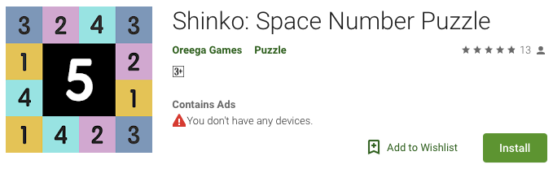

# Playing Shinko, a mobile game, with reinforcement learning
Shinko is a mobile puzzle game where you need to make added sum to 5 using blocks given to you. This mobile game have few specific features.

1. At the start of each game, you are given rows of boxes with random numbers drawn from 1 to 4. I will call them the matrix. 
2. You are also given another set of boxes (at length of 3). I will call them noxes (Number BOXES). You can use these noxes to make addition to the outer most layer of the matrix
3. When your addition (nox to matrix) makes 5, 5 (from the matrix) disappears. 
4. Your goal is to make all of the element in the matrix disappear with the smallest number of noxes. 
5. You will be able to see up to 3 future noxes. 

### Reinforcement learning to play the game
Result first. I was able to achieve ... 

### Training setup
#### Game playing module
shinko.py

#### Reinforcement learning module
....py

#### Comparision/evaluation module
....py

