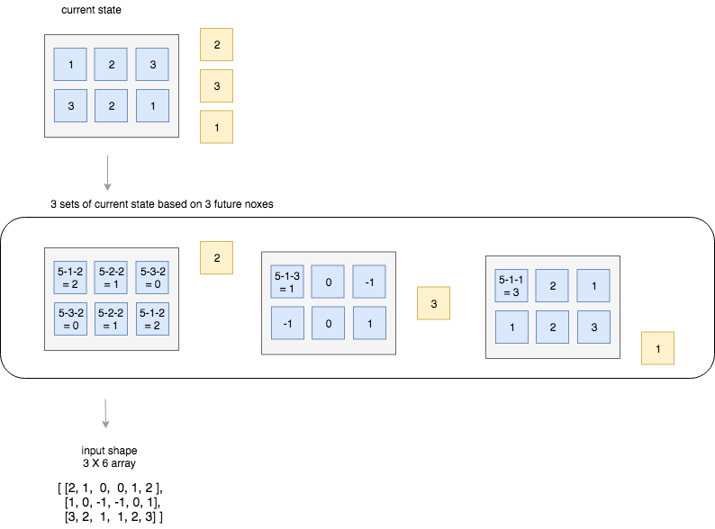

## Playing Shinko, a mobile game, with reinforcement learning
Shinko is a mobile puzzle game where you need to make added sum to 5 using blocks given to you. 


Shinko has few specific features.

1. At the start of each game, you are given rows of boxes with random numbers drawn from 1 to 4. I will call them matrix. 
2. You are also given another set of boxes (at length of 3). I will call them noxes (Number BOXES). You can use these noxes to make addition to the outer most layer of the matrix.
4. For example, nox is 3. If you add this nox to 2 in the matrix, then 3+2 is 5.
3. When the addition (nox to matrix) makes 5, 5 (from the matrix) disappears. 
4. Another example is when the result of the addition is bigger than 5. For example, if you add nox 4 to 2 in matrix, the result is 6 (4+2 = 6). In this case, the remainder of 1 (after making 5) breaks off. The origianl 2 disappears (because you have reached 5 or more by adding 4 to 2), however, 1 remains. So the total numbers in the matrix is not changed. This acts as a difficulty or penalty in the game.
4. Your goal is to make all of the element in the matrix disappear with the smallest number of noxes. 
5. You will be able to see up to 3 future noxes. You can strategically make your moves anticipating what noxes you will have in near future.


### Reinforcement learning to play the game
Result first. I was able to achieve ... 


### Training setup
#### Game playing module
`playShinko_vanilla.py` 
<br />
This script plays Shinko based on simple logic of addition. For the sake of simplicity, it simplifies the original mobile game by removing the spliting feature. Instead of the game allowing you to add 2 with 5 to make 7 (and then resulting remainder 2 remains), you are prohibited to make any move that will result in the sum of the addition to be larger than 5. `self.valid_actions` keeps track of what moves are valid to make for each turn. Here, `action` refers to the index of the matrix. So if `action` = 7, it means the player chooses to make the addition of nox to flattened matrix index 7.
<br />
<br />
The logic for `playShinko_vanilla.py` is simple. The machine will play the game by 
* Look at the next 1 nox
* Among the valid moves, choose the best move by making this calculation: 5 - matrix - nox
* If the result of the above calcuation is 0, that means the nox will surely make the addition to result in 5
* The model chooses the smallest result value (excluding negatives) as its best move

To see the sample of the vanilla play, execute the file in python
```python
python3 playShinko_vanilla.py
```

#### Reinforcement learning module
Reinforcement learning is divided into two components:
* `playShinko_rl.py`  
* `trainShinkoAgent.py`  

##### playShinko_rl.py
This file follows the same game features of the `playSHinko_vanilla.py`, but few new/altered configuration to enable the reinforcement learning. Most notably, this file pre-process the input data for the neural network built from keras.
<br />
<br />
In order to to feed the current state and noxes together to the neural network, I have transformed the input data into a shape of 3 by matrix_width array. Shinko agent must be able to anticipate the future value 



#### Comparision/evaluation module
`playShinko_rl_test.py`


